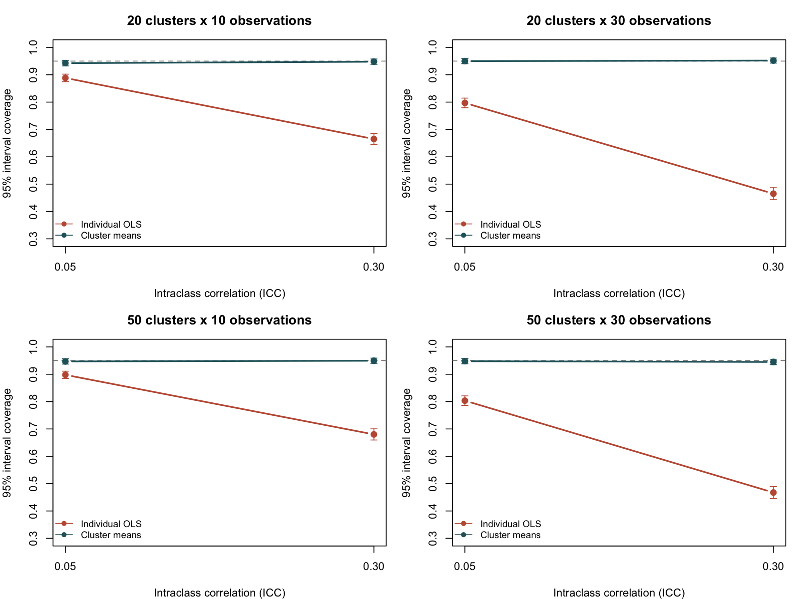

# Clustered Data: A Simulation of Confidence-Interval Coverage

A **new methods demonstration created on 8 October 2026**, using generated data to examine what happens when an analysis treats clustered observations as independent. It is not an analysis of thesis data or a reproduction of a published study.

## Question and design

When treatment is assigned at cluster level, how do individual-level OLS and an analysis of independent cluster means compare in bias, uncertainty, interval coverage, and rejection rate?

The data-generating model is `y_ij = beta * treatment_j + u_j + e_ij`, with normally distributed cluster intercepts and residual errors. Marginal outcome variance is 1; ICC determines its division between the two variance components. Half the clusters receive treatment. Clusters have equal sizes and independent random intercepts.

| Design factor | Values |
| --- | --- |
| Clusters | 20, 50 |
| Observations per cluster | 10, 30 |
| ICC | 0.05, 0.30 |
| Treatment effect | 0, 0.20 marginal SD |
| Replications per scenario | 2,000 |
| Random seed | 20261008 |

There are 16 scenarios and two methods. Both methods estimate the same difference in means in this balanced design; they differ in standard errors and degrees of freedom. The cluster-mean method uses a pooled-variance t interval with `clusters - 2` degrees of freedom. The individual OLS interval incorrectly uses `observations - 2` degrees of freedom and assumes independent residuals.

## Results

For 20 clusters with 30 observations each and ICC 0.30 under the null, individual OLS has **46.5% coverage** for nominal 95% intervals and a **53.5% false-positive rate**. The cluster-mean method has **95.2% coverage** and a **4.8% false-positive rate**. In this scenario, the Monte Carlo SE for cluster-method coverage is about 0.48 percentage points.



[The full summary](results/summary.csv) includes bias, RMSE, empirical SD, mean estimated SE, coverage, rejection rate, and Monte Carlo SEs. Rejection is type I error when the effect is zero and power when it is 0.20. Plot error bars show ±1.96 Monte Carlo SE; they describe simulation precision.

## Run

Requires R only:

```bash
Rscript analysis.R
```

For a quicker run:

```bash
Rscript analysis.R 500
```

The script writes the design table, summary, figure, and R session to `results/`. It checks its analytic coefficient and standard-error calculations against `lm()` on the first replication. Every simulated observation is generated locally; no external data downloads or participant data are required.

## Limits

The cluster-mean approach is appropriate for the balanced, cluster-randomized Gaussian design studied here. These results do not establish its performance for unequal cluster sizes, observational exposure, nonnormal outcomes, missing data, or within-cluster treatment assignment. A multilevel model or cluster-robust approach would be a useful extension for those designs.

```text
Clustered-Data-Inference-Simulation/
├── analysis.R
├── results/design.csv
├── results/summary.csv
├── results/coverage.png
├── results/session_info.txt
├── results/run_metadata.txt
├── .gitignore
└── README.md
```
